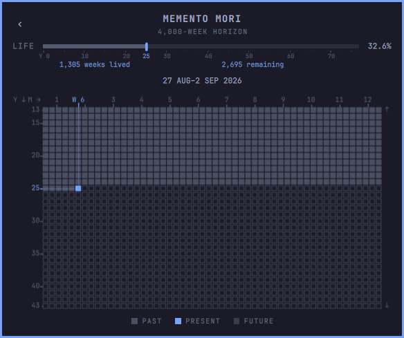

# Memento Mori Clock for Omarchy

A quiet, local Four Thousand Weeks view hidden inside Omarchy's familiar
clock and calendar.



The clock remains a clock: click it to open Calendar. Configure the LIFE rail
once with an exact birth date, then use that rail to enter a finite timeline
without leaving the native panel.

## Highlights

- 4,000 weeks is the default horizon, not a productivity target.
- Weeks and Months are two views of the same exact birth-anchored timeline.
- A compact, scrollable attention window keeps the present legible while the
  LIFE rail retains whole-horizon context.
- Lived, present, and remaining time inherit the active Omarchy theme.
- Hover resolves a cell to its exact date interval and coordinates on both
  axes without adding a second tooltip.
- The existing clock label, calendar, navigation, timezone action, and format
  cycling remain intact.
- Birth date and horizon settings stay local. The plugin has no telemetry,
  network service, account, or external runtime dependency.

The scope is intentionally narrow: no goals, habits, streaks, journaling,
quotes, coaching, milestones, or motivational notifications.

## Requirements

- Omarchy with Quickshell shell-plugin support.
- No external packages, services, or accounts.

The widget is designed as a replacement for the stock `omarchy.clock`, not as
an additional second clock.

Like every Omarchy shell plugin, this code runs unsandboxed inside the
long-lived shell process. Review third-party plugin code before enabling it.

## Install

Add the plugin, place it where the native clock currently sits, then remove
the native clock from the bar:

```bash
omarchy plugin add https://github.com/rishwanth-th/omarchy-plugin-memento-mori.git
omarchy plugin enable rishwanth.memento-mori --before omarchy.clock
omarchy plugin disable omarchy.clock
```

If your profile has already removed `omarchy.clock`, enable the plugin in the
section you prefer instead:

```bash
omarchy plugin enable rishwanth.memento-mori --section center
```

### Configure LIFE

1. Click the clock to open Calendar.
2. Double-click the year-progress rail.
3. Enter the birth date as `YYYY-MM-DD`.
4. Keep the horizon at `4000` for the Four Thousand Weeks default, or choose a
   personal override.
5. Press Enter, then press `M` or click the LIFE rail.

Inside Memento Mori, scroll or use the arrow keys to move the attention
window. Click `M →`, or press `P`, to toggle between Weeks and Months. Press
`M` to return to Calendar.
Press `A`, or triple-click an otherwise inert part of the grid, to alternate
between the calm projection seam and the exact date-overlap interference
animation. The calm seam remains the startup default. Press `T` or Enter to
return to the present.

The birth date and horizon are stored as widget settings in
`~/.config/omarchy/shell.json`. Do not commit that file unchanged to a public
or shared profile.

## Update

```bash
omarchy plugin update rishwanth.memento-mori
```

## Remove

Restore the native clock at the plugin's position before removing it:

```bash
omarchy plugin enable omarchy.clock --before rishwanth.memento-mori
omarchy plugin remove rishwanth.memento-mori
```

## Documentation

- [Design philosophy](docs/design.md) records the stable product and visual
  decisions behind V1.
- [Inspirations](docs/inspirations.md) identifies the bounded specimens and
  what each contributed.
- [Roadmap](docs/roadmap.md) holds V2 interaction questions without turning
  them into promised features.

## Development

```bash
npm test
omarchy plugin validate .
```

The implementation is deliberately small:

- `LifeRail.qml` renders whole-horizon progress.
- `LifeView.qml` renders the two Canvas projections and their interaction.
- `Model.js` owns exact date, horizon, projection, and clock behavior.
- `Panel.qml` and `BarWidget.qml` preserve the native clock/calendar shell.

The clock implementation derives from Omarchy's MIT-licensed `omarchy.clock`;
see [LICENSE](LICENSE) and [Inspirations](docs/inspirations.md).

## License

[MIT](LICENSE)
